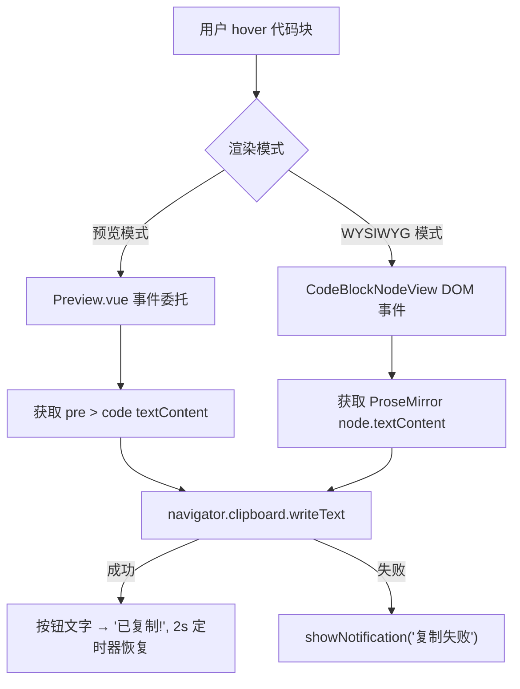

# 代码块复制功能 - 技术设计

Feature Name: code-block-copy
Updated: 2026-06-27

## 描述

在预览模式和 WYSIWYG 编辑模式的每个代码块右上角添加"复制"按钮，hover 时显示，点击复制纯文本代码到剪贴板，并显示 2 秒"已复制!"反馈。

## 架构



## 组件与接口

### 1. 预览模式 — markedSetup.ts + Preview.vue

**渲染端 (markedSetup.ts `codeBlockRenderer`)**

在 `code-block-wrapper` 内部添加复制按钮 HTML，与语言标签并列于右上角：

```html
<div class="code-block-wrapper">
  <span class="code-lang-label">javascript</span>
  <button class="code-copy-btn">复制</button>
  <pre><code class="hljs language-javascript">...</code></pre>
</div>
```

当无语言标签时，复制按钮独立占据右上角位置。

**交互端 (Preview.vue)**

在 `onMounted` 中对 `previewContentEl` 绑定 click 事件委托：

- 点击 `.code-copy-btn` 时：
  1. 获取 `<button>` 最近的 `.code-block-wrapper`
  2. 从中获取 `pre > code` 的 `textContent`
  3. 调用 `navigator.clipboard.writeText(text)`
  4. 修改按钮 `textContent` 为 `已复制!`
  5. 用 `setTimeout` 2 秒后恢复为 `复制`
  6. 失败时调用 `window.markflow.showNotification('复制失败')`

### 2. WYSIWYG 模式 — codeBlockLabel.ts

**DOM 构建端 (`buildCodeBlockDOM`)**

在函数返回值中新增 `copyBtn: HTMLButtonElement`，在 wrapper 中插入位置为 badge 之前或之后：

```typescript
const copyBtn = document.createElement('button')
copyBtn.className = 'code-copy-btn'
copyBtn.textContent = '复制'
copyBtn.addEventListener('click', (e) => {
  e.preventDefault()
  e.stopPropagation()
  // 由 NodeView 实例处理复制逻辑
})
wrapper.appendChild(copyBtn)  // 在 badge 之后
```

**交互端 (CodeBlockNodeView)**

在构造函数中添加属性 `private copyBtn: HTMLButtonElement`，并实现 `copyCode()` 方法：

```typescript
private copyCode() {
  const text = this.node?.textContent ?? ''
  if (!text.trim()) return
  navigator.clipboard.writeText(text).then(() => {
    this.copyBtn.textContent = '已复制!'
    setTimeout(() => { this.copyBtn.textContent = '复制' }, 2000)
  }).catch(() => {
    if (typeof window.markflow !== 'undefined') {
      window.markflow.showNotification('复制失败')
    }
  })
}
```

在 `buildCodeBlockDOM` 中为 copyBtn 绑定点击时调用 `this.copyCode()`（需通过闭包或 bind 引用实例）。

由于 `buildCodeBlockDOM` 在构造函数外且构造函数尚未创建，采用以下模式传递 handler：

1. 在 `buildCodeBlockDOM` 中为 `copyBtn` 添加 `dataset.copyHandler = 'pending'` 标记
2. 构造函数中将 handler 绑定到 `copyBtn`

或者更简洁：在 `buildCodeBlockDOM` 中创建按钮但不绑定事件，在构造函数中获取按钮并添加事件监听器。

## 数据模型

无新增数据模型。复制按钮是纯 UI 功能，不涉及持久化存储。

## CSS 设计

```css
/* 复制按钮基础样式 — 与语言标签共享视觉语言 */
.code-copy-btn {
  position: absolute;
  top: 0;
  right: 0;
  padding: 4px 10px;
  font-size: 11px;
  font-family: var(--font-mono);
  color: var(--text-muted);
  background: var(--bg-sidebar);
  border-bottom-left-radius: 6px;
  border-top-right-radius: 7px;
  border-left: 1px solid var(--border);
  border-bottom: 1px solid var(--border);
  user-select: none;
  line-height: 1.4;
  white-space: nowrap;
  cursor: pointer;
  opacity: 0;
  transition: opacity 0.15s;
}

.code-block-wrapper:hover .code-copy-btn {
  opacity: 1;
}

/* 无语言标签时，复制按钮独立存在于右上角 */
.code-block-wrapper:not(:has(.code-lang-label)) .code-copy-btn {
  border-top-right-radius: var(--radius);
}

/* 有语言标签时，复制按钮在语言标签右侧 */
.code-block-wrapper .code-lang-label + .code-copy-btn {
  border-top-right-radius: var(--radius);
}

/* 有语言标签时的布局：标签在右，按钮在标签右侧 */
.code-block-wrapper:has(.code-lang-label) .code-copy-btn {
  right: auto;
  right: 0;
}

/* 触摸设备始终可见 */
@media (hover: none) {
  .code-copy-btn { opacity: 1; }
}

/* 暗色主题 */
[data-theme="dark"] .code-copy-btn {
  background: #2a2a3e;
}

/* hover 高亮 */
.code-copy-btn:hover {
  color: var(--primary);
}

/* WYSIWYG 模式中语言标签用 badge 包裹，调整布局 */
.ProseMirror .code-block-wrapper .code-copy-btn {
  /* 复制按钮在 badge 右侧 */
}
```

## 不变式与约束

- 复制内容为纯文本，不包含 highlight.js 生成的 HTML 标签
- 复制按钮不参与 `user-select`，用户选择代码文本时不会选中按钮文字
- 同一时间一个代码块只有一个活跃的 `setTimeout`（重新点击刷新计时器）
- WYSIWYG 模式下，按钮在 `update()` 中保持存在（不在无语言时隐藏）

## 错误处理

| 场景 | 处理 |
|------|------|
| `navigator.clipboard` 不可用 | `showNotification('复制失败')` |
| `writeText` rejected | `showNotification('复制失败')` |
| 代码块内容为空 | 不触发复制操作 |
| 按钮在恢复前被销毁 | `setTimeout` 回调中判断按钮是否仍在 DOM |

## 测试策略

### 单元测试
- `markedSetup.ts`: 验证渲染输出中包含 `.code-copy-btn` 元素
- 验证代码块无语言时按钮仍存在

### 集成测试
- `note-crud.test.ts`: 扩展测试覆盖预览模式下复制按钮渲染
- 新建 `tests/integration/code-block-copy.test.ts`:
  - 预览模式：验证 hover 显示、点击复制、文字变化
  - WYSIWYG 模式：验证代码块中存在复制按钮

### 手动验证
- 浏览器 DevTools 检查剪贴板内容是否为纯文本
- 暗色/亮色主题下按钮样式一致性
- 移动端触摸设备按钮始终可见

## 涉及文件

| 文件 | 变更类型 |
|------|---------|
| `src/utils/markedSetup.ts` | 修改 `codeBlockRenderer` 添加按钮 HTML |
| `src/components/Preview.vue` | 添加事件委托处理复制 |
| `src/plugins/codeBlockLabel.ts` | `buildCodeBlockDOM` / `CodeBlockNodeView` 添加按钮和处理 |
| `src/style.css` | 添加 `.code-copy-btn` 样式 |
