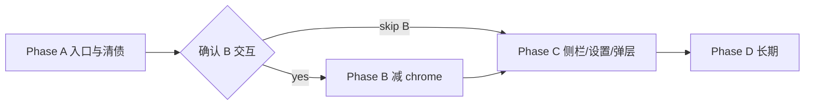

# MarkFlow UI 优化机会说明

## 落地状态

- 状态：**Phase A 已落地**（待推送 / 创建 PR）；Phase B–D 仍待确认
- 文档日期：2026-08-10
- Phase A 落地日期：2026-08-10
- 分支：`feature/pmb-260810-md`
- 分析报告：[`ui-phase-a-implementation-report.md`](./ui-phase-a-implementation-report.md)
- 关联文档：
  - [`markflow-ui-layout-redesign-plan.md`](./markflow-ui-layout-redesign-plan.md)（2026-08-06 布局复刻，核心已落地）
  - [`theme-entry-dedup-plan.md`](./theme-entry-dedup-plan.md)（主题入口收敛，已落地）

### Phase A 验收勾选

- [x] 顶栏可见搜索，点击与 `Ctrl/Cmd+K` 行为一致（同源 `toggleSearchModal`）
- [x] README / CHANGELOG 与当前组件清单一致（无 Tag* 组件树）
- [x] 设置文案指向「文件 → 导出 PDF」
- [x] 相关单测 / 架构 / 全量回归通过（782）
- [x] Code-review（Bugbot + Security）无中高风险未修项

### 本文档目的

在布局复刻与主题去重之后，对**当前可感知的 UI 摩擦**做一次结构化盘点，给出分优先级的优化方向与建议实施阶段，供产品取舍与后续 PR 拆分。

### 非目标（本轮文档）

- 不推倒现有 Vue / CSS 变量体系，不引入 Ant Design / Tailwind
- 不恢复已移除的标签系统
- Phase B–D 在未确认前不实施

---

## 1. 背景与现状

### 1.1 产品定位

MarkFlow 是 uTools 本地 Markdown 插件：三栏骨架 + 四视图（预览 / 分屏 / 源码 / 专注）+ 多页签 + 格式工具栏。近期主线已从「补能力」转向「打磨体验」。

### 1.2 已完成的 UI 收敛（勿重复立项）

| 事项 | 说明 | 参考 |
| --- | --- | --- |
| 布局复刻 | Design Token、内容宽 `--content-max`、FormatToolbar 图标化、侧栏 260px 等 | `markflow-ui-layout-redesign-plan.md` |
| 视图切换 | `ViewModeSwitcher` 已改为工作区 `ViewModeDropdown`，按 Tab 记忆 | PR #63 |
| 主题入口 | 顶栏主题按钮移除，设置面板为唯一入口 | `theme-entry-dedup-plan.md` / PR #62 |
| 分屏宽度 | 仅 `mode-live` 限制舞台宽度，分屏不再受 content-max 挤压 | 同上 |

### 1.3 当前壳层结构（简图）

```
┌ Topbar 48px：☰ Logo | 路径 │ 新建 / 文件 / 目录 / 设置 ┐
├ Sidebar ┬ workspace-chrome-bar：EditorTabBar ──────────┤
│  树/最近 │ FormatToolbar + ViewModeDropdown ───────────┤
│          │ Editor / Preview / Toc ─────────────────────┤
├──────────┴─────────────────────────────────────────────┤
│ StatusBar 24px：保存态 | 字数                          │
└────────────────────────────────────────────────────────┘
```

垂直 chrome 粗估：**顶栏 48 + 页签 36 + 格式栏 ≥36 + 状态栏 24 ≈ 144px+**（不含侧栏与 TOC）。

---

## 2. 问题盘点

按「用户是否立刻感知」排序。证据多来自 `src/App.vue`、`Toolbar.vue`、`Sidebar.vue`、`SearchModal.vue`、`FormatToolbar.vue`、`SettingsModal.vue`、`src/style.css`。

### 2.1 高价值

| ID | 问题 | 现状 | 影响 |
| --- | --- | --- | --- |
| H1 | **垂直 chrome 偏厚** | 多层独立横条叠加 | 小窗 / uTools 面板内正文区偏矮 |
| H2 | **搜索发现性弱** | 仅 `Ctrl+K`（`App.vue`），顶栏/侧栏无搜索按钮；`.sidebar-search` 等 CSS 像遗留 | 新手难发现全文搜索 |
| H3 | **顶栏上下文弱** | Logo + 文件夹路径；笔记标题只在页签 | 当前文档语义不突出；路径在窄屏被隐藏 |
| H4 | **死样式 / 文档漂移** | 标签 UI 已删，`style.css` 仍有 `.sidebar-tags` 等；README 仍写 TagCloud / NoteTagsBar | 误导后续 UI 决策与 onboarding |

### 2.2 中价值

| ID | 问题 | 现状 | 影响 |
| --- | --- | --- | --- |
| M1 | **图标体系不统一** | 多数 `AppIcon`；搜索 `🔍`、置顶 `📌` | 暗色主题与密度不一致 |
| M2 | **格式栏过密** | 分组多，`flex-wrap` 窄屏折行再占高 | 与 H1 叠加；专注栏能力与常驻栏不完全对齐 |
| M3 | **侧栏头缺少轻量操作** | 新建/搜索依赖顶栏或右键 | 「树」像只读列表，快捷操作路径偏长 |
| M4 | **设置页扁平** | 主题/字号/备份/清空一长列表；PDF 文案仍偏「工具栏 PDF 按钮」 | 认知负担；文案与「文件」菜单现状不符 |
| M5 | **弹层视觉不统一** | Search / CreateEntry / Settings / 移动笔记 modal 样式各异 | 产品感割裂 |

### 2.3 低价值 / 长期

| ID | 问题 | 说明 |
| --- | --- | --- |
| L1 | 响应式不足 | 仅 `@media (max-width: 720px)` 藏顶栏文案；侧栏无窄窗自动收起策略 |
| L2 | Token 阶梯不全 | 有颜色/圆角/内容宽；缺统一 elevation / spacing 阶梯；浅色 `--shadow: none` 层级偏平 |
| L3 | UI 字体偏通用 | `--font-ui: Inter`；可接受，非紧急 |
| L4 | 空状态 / 首次引导 | 无页签空态已有；侧栏空、首次使用引导可加强 |
| L5 | TOC 职责混杂 | 「插入目录」与导航同栏，低频操作可降级 |

---

## 3. 目标与原则

### 3.1 目标

1. **减 chrome、增正文**：在不砍核心能力的前提下降低默认垂直占用
2. **提高关键操作发现性**：搜索、新建等有可见入口，快捷键仍保留
3. **统一视觉语言**：图标、弹层、设置分组一致
4. **清债**：删除标签遗留样式与过时 README，避免假需求

### 3.2 设计原则（延续布局复刻）

- 轻量：细边框、弱 hover，避免多层阴影与装饰噪音
- 单栏写作保留 `--content-max`；分屏/源码占满可用宽
- 不引入第二套设计系统
- 改动可测：关键壳层变更配套架构/组件测

### 3.3 非目标

- 不做品牌 landing 级视觉改版
- 不重做侧栏树数据模型（最近文件夹逻辑可复用）
- 不恢复标签云 / NoteTagsBar

---

## 4. 方案建议（按优先级）

### Phase A — 低成本高感知（建议首轮）

| 项 | 建议做法 | 对应 |
| --- | --- | --- |
| A1 搜索入口 | 顶栏增加搜索按钮（打开现有 `SearchModal`）；可选侧栏顶部轻量搜索触发 | H2 |
| A2 清遗留 | 删除未使用的 `.sidebar-search` / `.sidebar-tags` 等死 CSS；同步 README（去掉标签组件树） | H4 |
| A3 文案修正 | `SettingsModal` PDF 提示改为指向「文件 → 导出 PDF」 | M4 |
| A4 图标统一 | 搜索、置顶改 `AppIcon`，去掉 emoji | M1 |

**验收（Phase A）**

- [ ] 顶栏可见搜索，点击与 `Ctrl+K` 行为一致
- [ ] README / CHANGELOG 与当前组件清单一致（无 Tag*）
- [ ] 设置文案不再提已不存在的顶栏 PDF 按钮路径（若确已迁入文件菜单）
- [ ] 相关单测 / 架构约束通过

### Phase B — 减垂直占用（需确认交互）

推荐方向（二选一或组合，**实施前需产品确认**）：

| 方案 | 描述 | 收益 | 风险 |
| --- | --- | --- | --- |
| **B-推荐** | **页签行右侧承接次要操作**；顶栏仅保留 ☰ / 品牌 / 主 CTA（新建）/ 搜索 / 设置 | 少一层心智 | 顶栏与 chrome-bar 职责重划 |
| B2 | 格式工具栏默认折叠，悬停或 `Ctrl+/` 展开；低频进 overflow | 省 ≥36px | 格式发现性下降，需快捷键提示 |
| B3 | 状态栏并入页签行右侧或仅脏态时显示 | 省 24px | 字数/保存反馈变弱 |

对应 H1、M2。与已落地的「视图下拉在格式栏右侧」兼容：折叠时视图入口需仍可触达（可钉在页签行）。

**待确认问题（实施 B 前）**

1. 顶栏是否允许进一步变矮 / 与页签合并？
2. 格式栏是否接受「默认折叠」？
3. 状态栏字数是否必须常驻？

### Phase C — 侧栏与设置结构化

| 项 | 建议 | 对应 |
| --- | --- | --- |
| C1 侧栏头 | 轻量「新建 + 搜索」图标行；不挤占树滚动区 | M3 |
| C2 设置分组 | 外观 / 编辑器 / 备份与数据 分区或简易 tabs | M4 |
| C3 弹层皮肤 | 统一 overlay、圆角、标题区、主按钮位置（Search / Settings / Create / 确认框） | M5 |

### Phase D — 长期 polish（可另立 PR）

- 窄窗自动收起侧栏（L1）
- spacing / elevation token（L2）
- 空状态与 TOC「插入目录」降级（L4、L5）
- 字体与微动效（L3，低优）

---

## 5. 建议实施顺序



1. **先落 Phase A**（独立小 PR，风险低）
2. **用线框确认 Phase B** 后再动 DOM 顺序（避免与布局复刻文档冲突却未更新）
3. Phase C 可与 B 并行拆 PR（设置分组 vs 侧栏头）
4. Phase D 按需排期

每阶段更新本文件「落地状态」，并在有布局结构变更时回写 `markflow-ui-layout-redesign-plan.md` 的线框说明。

---

## 6. 影响面预估

| 区域 | 可能改动文件 |
| --- | --- |
| 顶栏 / 搜索 | `Toolbar.vue`、`App.vue`、`AppIcon.vue`、`style.css` |
| 死代码清理 | `style.css`、`README.md`、必要时 `CHANGELOG.md` |
| 减 chrome | `App.vue`、`EditorTabBar.vue`、`FormatToolbar.vue`、`ViewModeDropdown.vue`、`style.css` |
| 侧栏头 | `Sidebar.vue`、`style.css` |
| 设置 / 弹层 | `SettingsModal.vue`、各 modal 共用 class、`style.css` |
| 测试 | `tests/architecture/*`、`tests/unit/components/*`、必要时集成测 |

约束：遵循 `AGENTS.md`（Vue 3 + Pinia + 现有 CSS 变量；TDD；提交信息 `[类型]: 简述 | 详细`）。

---

## 7. 风险与缓解

| 风险 | 缓解 |
| --- | --- |
| 减 chrome 改坏专注/分屏布局 | 按 `viewMode` 分用例回归；保留现有 `--content-max` 规则 |
| 搜索双入口状态不同步 | 单一 `searchModalVisible` 源；按钮只 emit/调用同一开关 |
| README 大改漏测 | 文档 PR 可与代码 PR 拆分；架构测断言「无 Tag 组件路径」 |
| uTools 窄面板回归不足 | 以 720px / 侧栏收起路径为手测清单 |

---

## 8. 测试计划（实施时）

### Phase A

- [ ] 顶栏搜索按钮打开/关闭 SearchModal
- [ ] `Ctrl+K` 与按钮互斥同一状态
- [ ] 暗色主题下搜索/置顶图标对比度
- [ ] 架构测：无 Tag* 组件引用；死 class 可选 grep 守护

### Phase B（若做）

- [ ] 四视图下 chrome 高度与内容区可用高度
- [ ] 格式栏折叠时仍能改视图、常用加粗/列表可达
- [ ] 专注模式退出与浮动工具栏不受影响

### Phase C

- [ ] 设置分区保存/取消行为不变
- [ ] 侧栏头新建与现有 `CreateEntryModal` 一致
- [ ] 各 modal 键盘 Esc / 点击遮罩关闭

---

## 9. 确认清单（请回复后实施）

请确认或改选：

1. **是否先做 Phase A**（搜索入口 + 清债 + 图标/文案）？默认：**是**
2. **Phase B** 选哪条？默认：**B-推荐（顶栏瘦身 + 页签行承接操作）**；是否接受格式栏默认折叠（B2）？
3. **状态栏**：保留常驻 / 合并到页签行 / 仅脏态显示？默认：**保留常驻**（B3 暂缓）
4. **Phase C** 是否紧随 A/B？默认：**A 之后做 C1+C2，C3 可并入**

确认后按分支规范从 `main` 切 `feature/pmb-YYMMDD-md`（或更细的 `ui-search-entry` 等）分 PR 落地，并回写本节落地状态。

---

## 10. 附录：与既有布局文档的关系

| 文档 | 关系 |
| --- | --- |
| `markflow-ui-layout-redesign-plan.md` | **基线已落地**；本文是其后的 polish 机会，不否定其 Token / 三栏决策 |
| `theme-entry-dedup-plan.md` | 主题已收敛；本文不再讨论顶栏主题按钮 |
| 本文件 | 后续 UI polish 的**唯一优先队列**；落地后勾选验收，避免重复分析 |

**一句话结论**：当前 UI 最大优化空间在「搜索可见性 + 垂直占用 + 遗留清债」，而非再做一轮品牌级视觉重设计。
