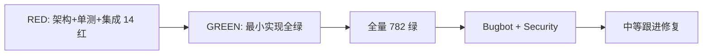

# Phase A UI 优化 · 实施与分析报告

## 摘要

按 [`界面优化机会说明.md`](./界面优化机会说明.md) **Phase A** 以 TDD 落地：顶栏搜索入口、标签遗留清债、PDF 文案修正、图标去 emoji。全量 **135 文件 / 782 用例**通过；Bugbot 与 Security Review **无中高风险未修项**。原有搜索 / 导入导出 / 视图切换行为保持不变。

| 项 | 值 |
| --- | --- |
| 分支 | `feature/pmb-260810-md` |
| 基线 | `main` @ `8316e86` |
| 落地日期 | 2026-08-10 |
| 提交 | `6ebb8d1`（RED）→ `0075387`（GREEN）→ `d90e318`（review 跟进） |

---

## 1. 需求对照

| ID | 计划项 | 结果 |
| --- | --- | --- |
| A1 | 顶栏搜索按钮，与 `Ctrl+K` 同源开关 | ✅ `Toolbar` emit `openSearch` → `App.toggleSearchModal` |
| A2 | 删除侧栏搜索/标签死 CSS；同步 README | ✅ `style.css` 净删约 300 行死样式；README 去掉 Tag* / tagNormalize 等 |
| A3 | Settings PDF 文案改「文件 → 导出 PDF」 | ✅ |
| A4 | 搜索/置顶改 `AppIcon`，去 emoji | ✅ 新增 `search` / `pin` |

非目标遵守：未做 Phase B 减 chrome、未恢复标签、未引入新 UI 库。

---

## 2. TDD 过程



1. **RED**：新增 `tests/architecture/ui-phase-a-polish.test.ts`、`tests/integration/toolbar-search-entry.test.ts`，并扩展 Toolbar / Settings / SearchModal / SidebarTreeRow 单测 → **14 failed / 34 passed**
2. **GREEN**：实现入口、图标、文案、清债；修正既有 Toolbar 测试因新增「搜索」按钮误点菜单的选择器 → Phase A 相关 **48 passed**
3. **回归**：`npx vitest run` → **135 / 782 passed**
4. **Review 跟进**：快捷键文案 `Ctrl/Cmd`；去掉 `wysiwyg-task-list-toolbar` 中 `NoteTagsBar` 残留 stub

---

## 3. 关键要点

### 3.1 搜索同源（防双状态）

```ts
// App.vue
function toggleSearchModal() {
  searchModalVisible.value = !searchModalVisible.value
}
// Toolbar @openSearch 与 Ctrl/Cmd+K 均调用同一函数
```

### 3.2 测试可维护性

新增 `data-testid="toolbar-search-btn"` / `toolbar-file-btn`，避免 `.btn-icon-text` 多按钮歧义（曾导致 5 个导入导出用例假红）。

### 3.3 清债范围

移除未引用的 `.sidebar-search`、`.search-result-*`、`.sidebar-tags` / `.tag-cloud-*` / `.note-tags-bar` 等；`SearchModal` 的 `search-modal-*` 样式保留。

---

## 4. Code Review 结论

| 来源 | 结论 |
| --- | --- |
| [Bugbot](4f8784cc-c066-442b-8294-e9ea53016096) | 未发现 bug |
| [Security Review](58c11240-6bd2-49eb-8330-ede61bf4e85e) | 无 medium/high/critical；无新 XSS / 凭证 / 攻击面 |

### 自行复核与已修中等项

| 严重度 | 发现 | 处理 |
| --- | --- | --- |
| 中 | 新增搜索按钮后，既有 Toolbar 单测用首个 `.btn-icon-text` 点开文件菜单失败 | GREEN 阶段改为 `toolbar-file-btn` |
| 中（卫生） | 集成测仍 stub 已删除的 `NoteTagsBar` | 已删除 stub |
| 低→跟进 | 快捷键仅写 `Ctrl+K`，但逻辑支持 `metaKey` | 文案改为 `Ctrl/Cmd+K` |
| 信息 | 专注模式隐藏顶栏，搜索按钮不可见 | **非回归**；`Ctrl/Cmd+K` 仍可用，保持专注沉浸 |

未改动搜索结果渲染路径，摘要仍走文本插值（无 `v-html`）。

---

## 5. 影响面与回归范围

| 区域 | 文件 |
| --- | --- |
| 壳层 | `App.vue`、`Toolbar.vue` |
| 图标 | `AppIcon.vue`、`SearchModal.vue`、`SidebarTreeRow.vue` |
| 文案 | `SettingsModal.vue`、`CHANGELOG.md`、`README.md` |
| 样式 | `src/style.css`（死样式删除） |
| 测试 | architecture / integration / unit 上述组件 |

**未触及**：编辑器引擎、存储、导入导出核心逻辑、视图模式调度（除搜索入口接线）。

---

## 6. 验证证据

```text
npx vitest run
# Test Files  135 passed (135)
# Tests       782 passed (782)
```

定向：

```text
npx vitest run tests/architecture/ui-phase-a-polish.test.ts \
  tests/integration/toolbar-search-entry.test.ts \
  tests/unit/components/Toolbar.test.ts \
  tests/unit/components/SettingsModal.test.ts \
  tests/unit/components/SearchModal.test.ts \
  tests/unit/components/SidebarTreeRow.test.ts
# 48 passed
```

---

## 7. 风险残余与后续

| 项 | 说明 |
| --- | --- |
| 专注模式搜索发现性 | 仅快捷键；若产品要求专注下也有按钮，属 Phase B/C 范畴 |
| 推送 / PR | 本地分支已提交，需按仓库流程 `push` + `gh pr create` |
| Phase B | 减垂直 chrome 仍待产品确认（见主计划 §9） |

---

## 8. 结论

Phase A **完成且可合并**：搜索可发现性提升、文档/样式与代码一致、图标体系统一，且经 TDD + 全量回归 + 双审查，**未发现需阻断的中高风险**；跟进项已落在 `d90e318`。
