# MarkFlow 架构设计文档

> 版本：v1.0 | 更新日期：2025-06-07  
> 关联文档：[产品设计文档](../产品设计/产品设计文档.md) · [开发计划](../产品设计/开发计划.md)

---

## 1. 架构概述

### 1.1 设计目标

MarkFlow 是一款 **uTools 插件形态的本地 Markdown 编辑器**，架构设计围绕以下目标：

| 目标 | 策略 |
|------|------|
| 本地优先 | 数据全部存于 uTools dbStorage，无网络依赖 |
| 双引擎编辑 | Milkdown（WYSIWYG）+ CodeMirror 6（源码），按视图模式切换 |
| 环境透明 | preload 桥接 + useStorage 抽象，开发/生产环境无感切换 |
| 性能可控 | 防抖持久化、大文件策略、目录虚拟列表 |
| 可测试 | Pinia 状态中心 + 桥接 Mock，单元/集成/架构三层测试 |

### 1.2 技术栈

```
┌─────────────────────────────────────────────────────────┐
│  运行时：uTools Electron WebView / 浏览器（开发调试）    │
├─────────────────────────────────────────────────────────┤
│  UI 层：Vue 3 (Composition API) + Pinia                 │
├─────────────────────────────────────────────────────────┤
│  编辑引擎：Milkdown 7 (ProseMirror) / CodeMirror 6      │
├─────────────────────────────────────────────────────────┤
│  渲染引擎：marked + highlight.js (分屏预览)              │
├─────────────────────────────────────────────────────────┤
│  构建：Vite 8 + TypeScript 6 + vue-tsc                  │
├─────────────────────────────────────────────────────────┤
│  测试：Vitest + jsdom + @vue/test-utils                  │
└─────────────────────────────────────────────────────────┘
```

### 1.3 目录结构

```
markflow/
├── public/
│   ├── plugin.json          # uTools 插件清单
│   ├── preload.js           # Node.js 桥接层（CommonJS，不压缩）
│   └── logo.png
├── src/
│   ├── main.ts              # 应用入口
│   ├── App.vue              # 根组件：视图模式调度
│   ├── constants.ts         # 全局常量（阈值、防抖时间）
│   ├── style.css            # 全局样式 + 主题变量
│   ├── types/index.ts       # TypeScript 类型 + 桥接接口
│   ├── stores/note.ts       # Pinia 状态中心
│   ├── components/          # UI 组件
│   │   ├── Toolbar.vue      # 顶栏：视图切换、导入导出
│   │   ├── Sidebar.vue      # 侧边栏：笔记/文件夹管理
│   │   ├── Editor.vue       # CodeMirror 源码编辑器
│   │   ├── WysiwygEditor.vue# Milkdown WYSIWYG 编辑器
│   │   ├── Preview.vue      # marked 实时预览
│   │   └── Toc.vue          # 目录导航
│   ├── composables/         # 可复用逻辑
│   │   ├── useStorage.ts    # 存储抽象层
│   │   ├── useTheme.ts      # 主题管理
│   │   ├── useScrollSync.ts # 分屏滚动同步
│   │   ├── useTocHeadings.ts# 标题解析
│   │   ├── useTocScroll.ts  # 目录跳转滚动
│   │   └── useTocJumpHandler.ts
│   └── utils/notify.ts      # 通知工具
├── tests/
│   ├── setup.ts             # 全局 Mock（markflow bridge）
│   ├── unit/                # 单元测试
│   ├── integration/         # 集成测试
│   └── architecture/        # 架构约束测试
├── vite.config.ts           # 构建配置 + 代码分割
└── vitest.config.ts         # 测试配置
```

---

## 2. 系统上下文

### 2.1 部署拓扑

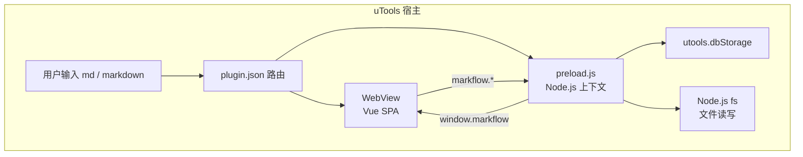

### 2.2 运行环境对比

| 维度 | uTools 生产环境 | 浏览器开发环境 |
|------|----------------|----------------|
| 入口 | `dist/index.html` | `http://localhost:5173` |
| 桥接 | `preload.js` → `window.markflow` | 无 bridge，localStorage 回退 |
| 存储 | `utools.dbStorage` | `localStorage` |
| 文件 IO | `showSaveDialog` / `showOpenDialog` + fs | Blob 下载 / FileReader |
| 通知 | `utools.showNotification` | `console.warn` |
| 主题 | `utools.isDarkColors()` | `prefers-color-scheme` |

---

## 3. 分层架构

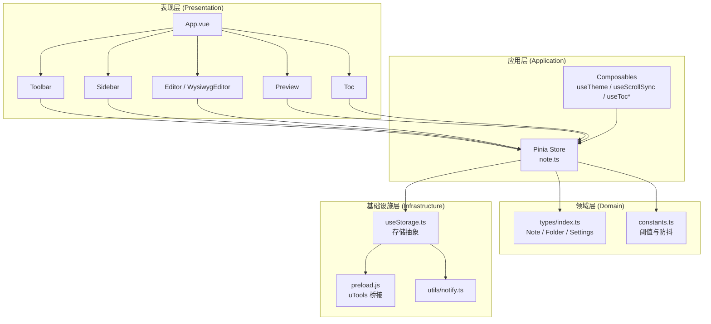

### 3.1 各层职责

| 层级 | 职责 | 禁止事项 |
|------|------|----------|
| **表现层** | 渲染 UI、处理用户交互、管理编辑器实例生命周期 | 直接调用 `utools.*` 或 `localStorage` |
| **应用层** | 业务逻辑编排、状态管理、跨组件通信 | 操作 DOM、实例化编辑器引擎 |
| **领域层** | 类型定义、业务常量 | 依赖框架或平台 API |
| **基础设施层** | 平台适配、持久化、通知 | 包含 UI 逻辑 |

---

## 4. 核心模块设计

### 4.1 桥接层（preload.js）

preload 脚本在 uTools 的 Node.js 上下文中执行，将平台能力挂载到 `window.markflow`，供 WebView 中的 Vue 应用调用。

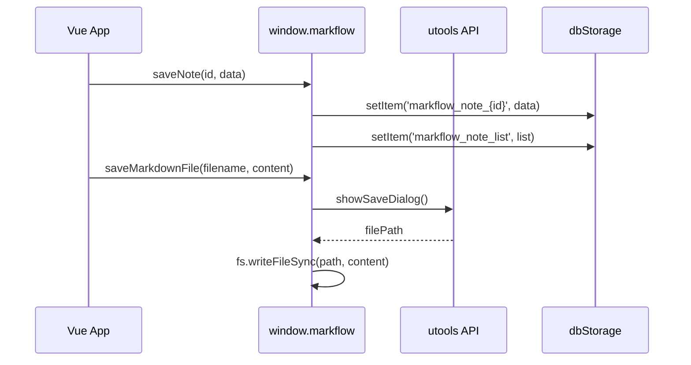

**接口契约**（定义于 `src/types/index.ts` → `MarkFlowBridge`）：

| 分类 | 方法 | 说明 |
|------|------|------|
| 笔记 | `getNoteList` / `saveNoteList` | 笔记索引列表 |
| 笔记 | `getNote(id)` / `saveNote(id, data)` / `removeNote(id)` | 单篇笔记 CRUD |
| 文件夹 | `getFolderList` / `saveFolderList` | 文件夹列表 |
| 设置 | `getSettings` / `saveSettings` | 应用设置 |
| 文件 | `saveMarkdownFile` / `openMarkdownFile` | 导入/导出 .md |
| 系统 | `showNotification` / `isDarkTheme` / `hideMainWindow` | 系统能力 |

> preload.js 使用 CommonJS，不参与 Vite 打包，uTools 要求不压缩。

### 4.2 存储抽象层（useStorage）

`useStorage` 是存储的唯一入口，实现 **策略模式**：运行时检测 `window.markflow` 是否存在，自动选择 uTools 或 localStorage 后端。

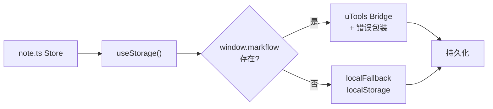

**双写策略**：`saveNote(note)` 同时更新：
1. `markflow_note_list` — 轻量索引（`NoteListItem[]`）
2. `markflow_note_{id}` — 完整笔记（`Note`）

这种 **索引 + 正文分离** 的设计避免列表加载时读取全部笔记内容。

**存储 Key 设计**：

| Key | 类型 | 用途 |
|-----|------|------|
| `markflow_note_list` | `NoteListItem[]` | 侧边栏列表渲染 |
| `markflow_note_{id}` | `Note` | 单篇笔记完整数据 |
| `markflow_folder_list` | `Folder[]` | 文件夹列表 |
| `markflow_settings` | `AppSettings` | 用户设置 |

**错误处理**：uTools 环境下，写操作通过 `wrapBridgeSave` 包装，捕获 quota 异常并调用 `showAppNotification` 通知用户。

### 4.3 状态中心（Pinia Store）

`stores/note.ts` 是应用的 **唯一状态中心**，所有组件通过 Store 读写数据。

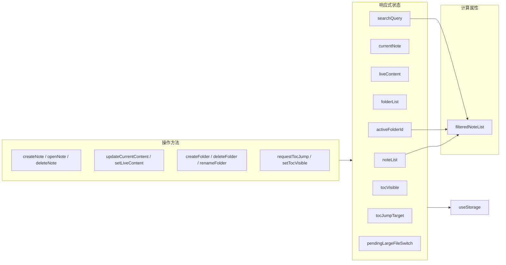

**关键设计：`liveContent` 作为编辑器唯一内容源**

```
用户输入 → Editor/WysiwygEditor
              ↓ setLiveContent (即时)
           liveContent (内存)
              ↓ debounce 300ms
           updateCurrentContent → storage.saveNote
```

- `liveContent`：编辑器实时内容，供 Preview、Toc 等读取
- `currentNote.content`：持久化内容，仅在保存时更新
- 切换笔记时：`openNote` → 同步 `liveContent = note.content`

**编辑器同步策略（方案 A）**：

编辑器组件 **仅 watch `currentNote.id`**，不 watch `currentNote.content`。避免防抖保存回写触发全量刷新导致光标跳到末尾。此约束由 `tests/architecture/editor-sync.test.ts` 强制验证。

### 4.4 视图模式架构

`App.vue` 作为 **视图调度器**，根据 `viewMode` 决定渲染哪些组件。

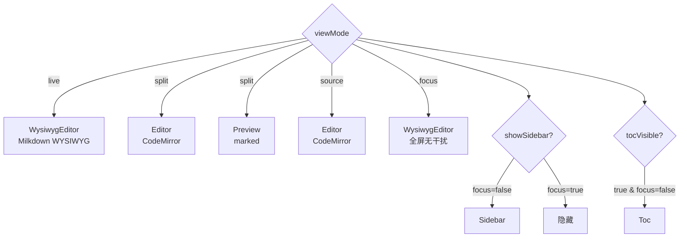

| 模式 | 编辑引擎 | 渲染引擎 | 侧边栏 | 工具栏 | 目录 |
|------|----------|----------|--------|--------|------|
| `live` | Milkdown | ProseMirror 内置 | ✅ | 顶栏 | 可选 |
| `split` | CodeMirror 6 | marked + hljs | ✅ | 编辑器内 | 可选 |
| `source` | CodeMirror 6 | 无 | ✅ | 编辑器内 | 可选 |
| `focus` | Milkdown | ProseMirror 内置 | ❌ | 仅退出按钮 | ❌ |

**大文件自动切换**：

```
openNote / createNoteWithContent
    ↓ content.length > 200KB
pendingLargeFileSwitch = true
    ↓ App.vue watch
viewMode = 'split' + 通知用户
```

**专注模式退出**：`prevMode` 记录进入 focus 前的模式，Esc 或点击退出按钮恢复。

---

## 5. 编辑器双引擎设计

### 5.1 引擎选型与分工

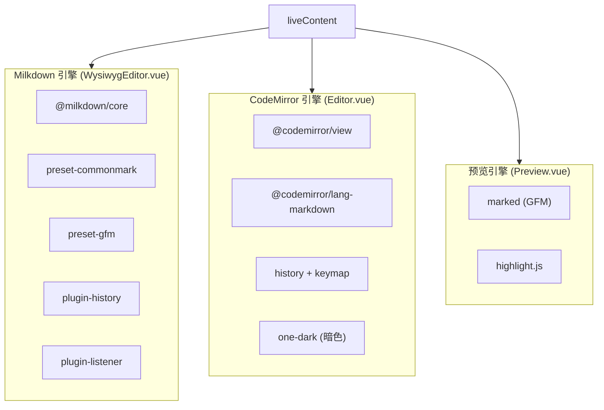

| 引擎 | 使用场景 | 内容同步方式 |
|------|----------|-------------|
| **Milkdown** | live / focus 模式 | `listenerCtx.markdownUpdated` → debounce 300ms → Store |
| **CodeMirror** | split / source 模式 | `EditorView.updateListener` → debounce 300ms → Store |
| **marked** | split 模式预览 | watch `liveContent` → debounce 150ms/600ms → v-html |

### 5.2 编辑器生命周期

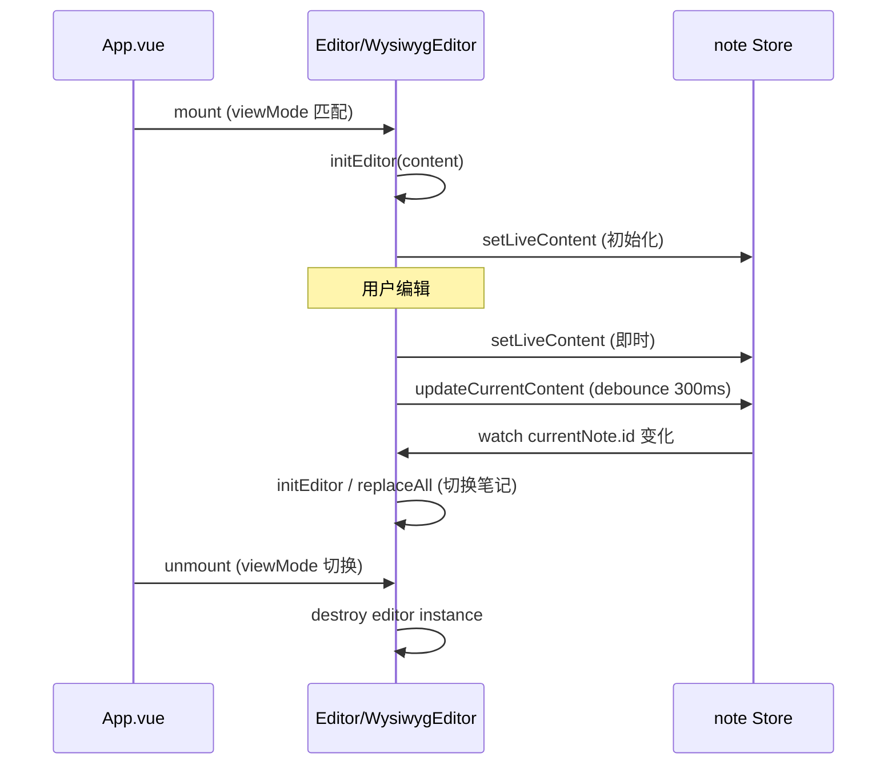

**关键约束**：
- 视图模式切换时，旧编辑器 destroy、新编辑器 init（非共存）
- Milkdown 主题切换需 destroy + recreate（watch `isDark`）
- CodeMirror 主题切换同样 recreate extensions

### 5.3 分屏滚动同步

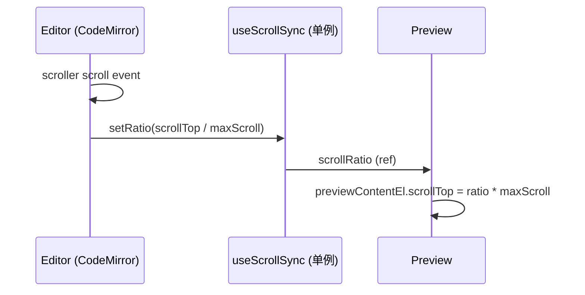

- `useScrollSync` 使用模块级单例 `scrollRatio`，Editor 写入、Preview 读取
- `requestAnimationFrame` 锁防止同一帧重复写入导致抖动

---

## 6. 目录导航架构

### 6.1 数据流

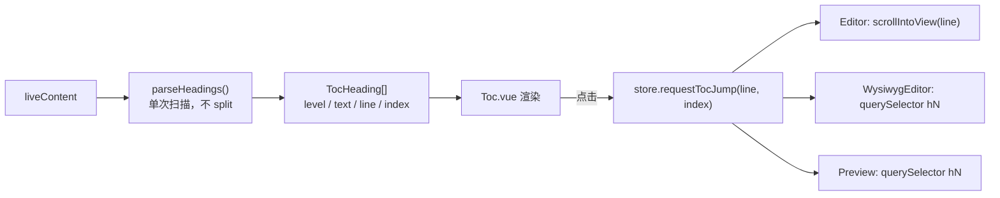

### 6.2 性能优化

| 策略 | 阈值 | 实现 |
|------|------|------|
| 解析防抖 | 400ms | `TOC_PARSE_DEBOUNCE_MS` |
| 单次扫描 | — | `parseHeadings` 用 indexOf 逐行，避免 `split('\n')` |
| 虚拟列表 | > 150 条标题 | `Toc.vue` 固定行高 30px + 窗口化渲染 |
| 跳转重试 | 最多 120 帧 | `useTocJumpHandler` 等待 DOM 渲染完成 |

---

## 7. 主题系统

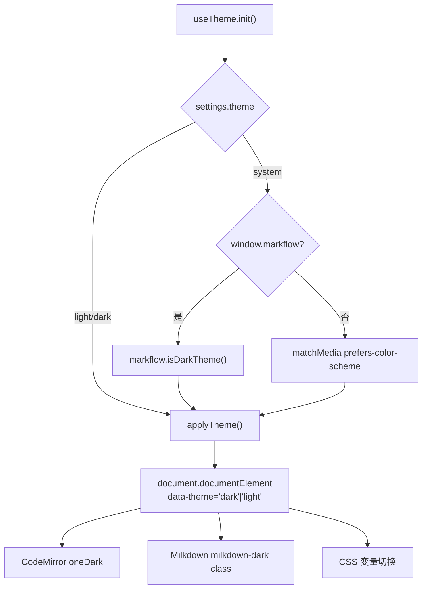

- 主题状态：`document.documentElement[data-theme]`
- 各编辑器通过 `computed isDark` 监听 DOM 属性变化
- 用户手动切换：toggle → 保存到 settings → 不再跟随系统

---

## 8. 构建与部署

### 8.1 构建流程

```
npm run build
  ├── vue-tsc -b          # TypeScript 类型检查
  └── vite build          # 打包到 dist/
        ├── index.html
        ├── assets/
        │   ├── vendor.js     # vue + pinia
        │   ├── editor.js     # codemirror
        │   ├── markdown.js   # marked + highlight.js
        │   └── index.js      # 应用代码
        └── (public/ 静态资源复制)
```

### 8.2 代码分割策略

`vite.config.ts` 通过 `manualChunks` 按依赖域拆分：

| Chunk | 包含 | 加载时机 |
|-------|------|----------|
| `vendor` | vue, pinia | 始终 |
| `editor` | codemirror 全家桶 | split/source 模式 |
| `markdown` | marked, highlight.js | split 模式预览 |
| `index` | 应用代码 + milkdown | 始终（live 模式需 milkdown） |

### 8.3 uTools 插件配置

`public/plugin.json` 关键字段：

```json
{
  "main": "index.html",
  "preload": "preload.js",
  "development": {
    "main": "http://localhost:5173",
    "preload": "preload.js"
  },
  "features": [{ "code": "open-editor", "cmds": ["md", "markdown", "笔记"] }]
}
```

开发时 uTools 加载 localhost:5173（HMR），生产时加载 dist/index.html。

---

## 9. 性能设计

### 9.1 防抖策略总览

| 操作 | 延迟 | 常量 | 触发场景 |
|------|------|------|----------|
| 内容持久化 | 300ms | — | 编辑器输入 |
| 预览渲染（常规） | 150ms | `PREVIEW_RENDER_DEBOUNCE_MS` | liveContent 变化 |
| 预览渲染（大文件） | 600ms | `PREVIEW_LARGE_DEBOUNCE_MS` | content > 200KB |
| 目录解析 | 400ms | `TOC_PARSE_DEBOUNCE_MS` | liveContent 变化 |

### 9.2 大文件策略

```
LARGE_FILE_THRESHOLD = 200_000 (200KB)

内容 > 200KB 时：
├── 打开笔记 → pendingLargeFileSwitch → 自动切分屏
├── WYSIWYG 渲染性能下降 → 分屏模式用 CodeMirror 编辑
└── 预览防抖从 150ms 增至 600ms
```

### 9.3 内存管理

- 视图切换时 destroy 编辑器实例，避免多引擎共存
- Milkdown `replaceAll` 用于笔记切换（同引擎内）
- CodeMirror `initEditor` 用于笔记切换（destroy + create）

---

## 10. 测试架构

### 10.1 测试分层

```
tests/
├── setup.ts                 # 全局 Mock：window.markflow + localStorage
├── unit/                    # 单元测试：Store、Composable、Utils
│   ├── stores/note.test.ts
│   ├── composables/*.test.ts
│   └── constants.test.ts
├── integration/             # 集成测试：跨模块流程
│   └── note-crud.test.ts
└── architecture/            # 架构约束测试：设计规则强制
    ├── storage-abstraction.test.ts
    └── editor-sync.test.ts
```

### 10.2 Mock 策略

`tests/setup.ts` 提供完整的 `window.markflow` Mock，底层使用 localStorage 作为 backing store，确保：
- 测试环境与生产接口一致
- `localStorage.clear()` 可清理所有测试数据
- 非 uTools 回退路径可独立验证

### 10.3 架构约束测试

| 测试文件 | 验证规则 |
|----------|----------|
| `storage-abstraction.test.ts` | bridge 接口完整性、双写策略、环境切换 |
| `editor-sync.test.ts` | 编辑器不 watch `currentNote.content`（方案 A） |

---

## 11. 安全设计

| 方面 | 策略 | 实现位置 |
|------|------|----------|
| 数据隐私 | 全部本地存储，无网络请求 | 架构层面 |
| XSS 防护 | marked / Milkdown 输出转义 | 引擎内置 |
| 文件操作 | 用户主动选择路径 | preload 对话框 |
| 存储异常 | 捕获 quota 错误，通知用户 | useStorage + notify |
| v-html 使用 | 仅渲染用户自己的 Markdown | Preview.vue |

---

## 12. 组件依赖关系

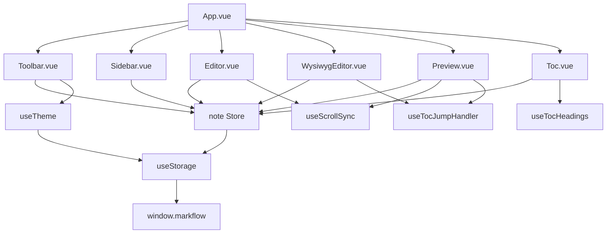

**依赖规则**：
- 组件 → Store / Composable（不允许组件间直接通信）
- Store → useStorage（不允许 Store 直接访问 bridge）
- Composable 间：`useScrollSync` 为模块单例，其余无交叉依赖

---

## 13. 扩展点设计

为后续版本（v1.1+）预留的架构扩展点：

| 扩展点 | 当前状态 | 扩展方式 |
|--------|----------|----------|
| 全文搜索 | 标题过滤 | Store 增加 searchIndex + Composable |
| 标签系统 | 数据字段已有 | Sidebar + TagInput 组件 |
| 笔记排序 | 按 updatedAt | NoteListItem 扩展 pinned/sortOrder |
| 图片存储 | 未实现 | preload 扩展 asset CRUD + 新 storage key |
| 插件扩展 | 未实现 | 定义 PluginInterface + 渲染钩子 |
| 云同步 | 未实现 | useStorage 后端策略扩展（WebDAV adapter） |
| 多 Tab | 单 currentNote | Store 改为 openTabs[] + activeTabId |

### 13.1 存储后端扩展模式

```typescript
// 未来扩展示意 — 不改变上层 Store 接口
interface StorageBackend {
  getNoteList(): NoteListItem[]
  saveNote(note: Note): void
  // ...
}

// 当前：uToolsBackend | localStorageBackend
// 未来：+ webdavBackend | indexedDBBackend
```

---

## 14. 架构决策记录（ADR）

### ADR-001：双引擎而非统一引擎

**背景**：WYSIWYG 和源码编辑体验差异大，单一引擎难以兼顾。  
**决策**：Milkdown 负责 WYSIWYG（live/focus），CodeMirror 负责源码（split/source）。  
**代价**：视图切换需 destroy/recreate 编辑器；内容通过 Store 中转同步。  
**收益**：各取所长，用户体验最优。

### ADR-002：索引与正文分离存储

**背景**：笔记列表需快速加载，不应读取全部正文。  
**决策**：`note_list`（轻量索引）+ `note_{id}`（完整正文）双 Key 存储。  
**代价**：saveNote 需双写；删除需同步清理。  
**收益**：列表加载 O(n) 仅读索引，不读正文。

### ADR-003：preload 桥接而非直接调用 utools

**背景**：开发环境无 uTools API，需浏览器调试。  
**决策**：preload 挂载 `window.markflow`，useStorage 透明切换。  
**代价**：多一层间接调用；需维护接口契约。  
**收益**：开发/生产环境代码完全一致，可测试。

### ADR-004：编辑器仅 watch note.id（方案 A）

**背景**：防抖保存回写 currentNote.content 会触发编辑器全量刷新，光标跳末尾。  
**决策**：编辑器 watch `currentNote.id`，仅在切换笔记时刷新内容。  
**代价**：外部修改 content（如导入）需通过切换笔记触发刷新。  
**收益**：编辑过程中光标稳定，用户体验流畅。

### ADR-005：liveContent 作为编辑中转层

**背景**：多个消费者（Preview、Toc、Editor）需读取最新内容。  
**决策**：`liveContent` 为内存中的实时内容，`currentNote.content` 为持久化快照。  
**代价**：两份内容需保持同步。  
**收益**：Preview/Toc 无需等待持久化即可渲染最新内容。

---

## 附录 A：数据流全景

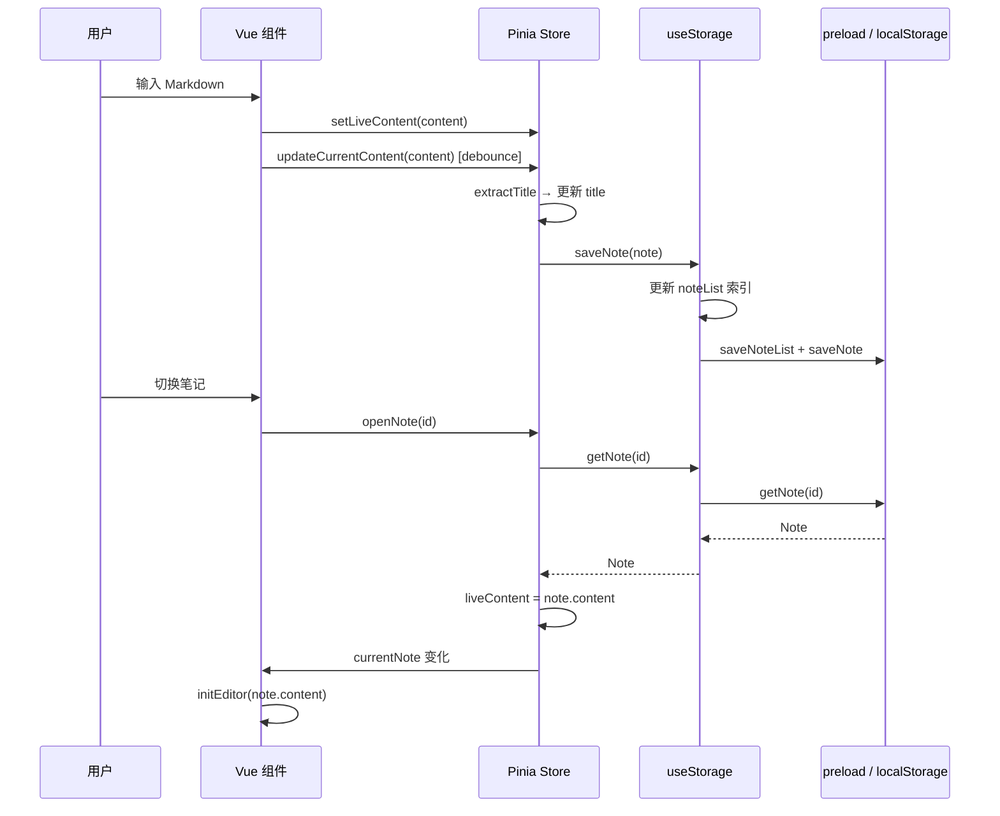

## 附录 B：相关文档索引

| 文档 | 路径 | 内容 |
|------|------|------|
| 产品设计文档 | `docs/产品设计/产品设计文档.md` | 功能规格、用户流程、数据模型 |
| 开发计划 | `docs/产品设计/开发计划.md` | 版本路线图、任务分解 |
| 架构设计文档 | `docs/架构设计/架构设计文档.md` | 本文档 |
| 插件清单 | `public/plugin.json` | uTools 插件配置 |
| 桥接脚本 | `public/preload.js` | uTools API 桥接 |
| 类型定义 | `src/types/index.ts` | 数据模型 + 桥接接口 |
